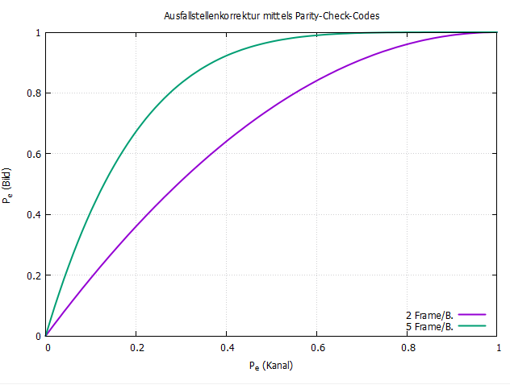
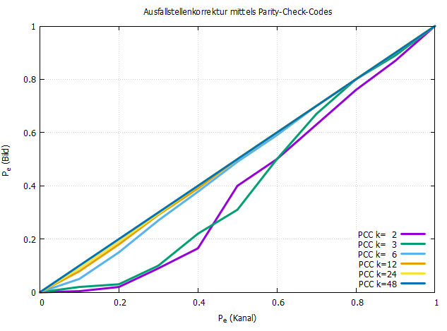

# Aufgabe 4

Formel: P(Verlust) = 1 - (1-Verlustrate)^RTP

- Je größer die Verlustrate, desto größer ist die Wahrschreinlichkeit, dass ein Paket verloren geht.
- Je mehr Pakete verschickt werden, desto größer ist die Wkt., dass zmd. einige Pakete ankommen.

# Aufgabe 6

## Aufgabe 6.1
Gruppengröße 11
- Gruppengröße gibt an wie viele Frames aus dem Video in der Gruppe sind
- wenn ein Bild in dem Paket verloren geht kann es nur rekonstruiert werden wenn alle Bilder aus der Gruppe vorhanden
- größere Gruppen -> höhere Wkt., dass Bilder fehlen somit kann das Bild nicht rekonstruiert werden -> mehr Laggs

## Aufgabe 6.2
siehe results.txt in statistics

## Aufgabe 6.3

# Aufgabe 7
- Verbindung zu VLC hat geklappt aber abspielen ging nicht

# Aufgabe 8
- Eventuell wichtige Teile des bestehenden Codes erklären in einem Video/Praktikum
- mehr Kommentare im Quellcode